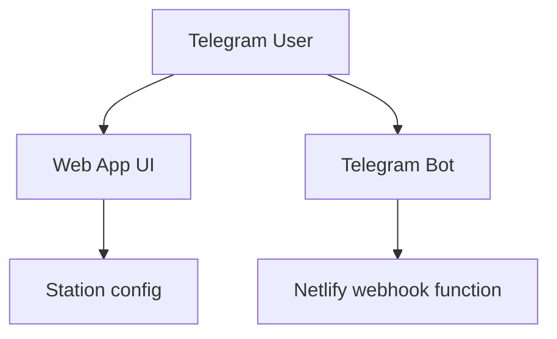
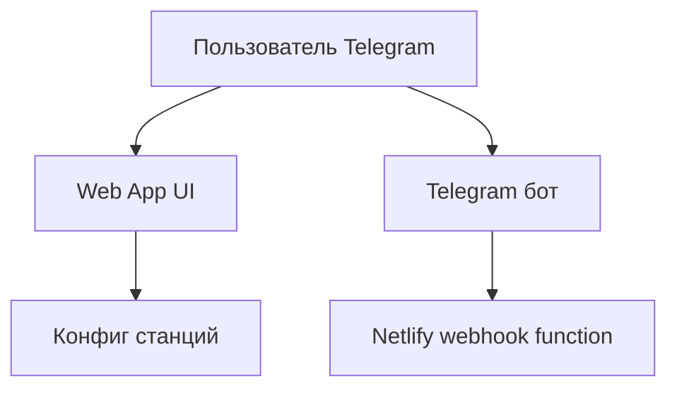

# RuWorshipRadioApp

## English
## Problem
Worship radio listeners in Telegram need a simple in-app player without switching to external websites/apps.
## Solution
RuWorshipRadioApp provides a Telegram Web App + webhook backend for radio station playback and bot integration.
## Tech Stack
- Node.js, TypeScript
- Next.js
- Telegram Web App / Bot API
- Netlify Functions
## Architecture
```text
netlify/functions/
public/
src/config/
netlify.toml
package.json
```

## Features
- Telegram Web App player UI
- Configurable radio station list
- Webhook integration for Telegram bot flows
- Netlify-ready deployment
## How to Run
```bash
yarn install
cp .env.example .env
yarn netlify:dev
```

## Русский
## Проблема
Слушателям worship-радио в Telegram нужен удобный встроенный плеер без перехода на внешние сайты и приложения.
## Решение
RuWorshipRadioApp предоставляет Telegram Web App + webhook backend для воспроизведения станций и интеграции с ботом.
## Стек
- Node.js, TypeScript
- Next.js
- Telegram Web App / Bot API
- Netlify Functions
## Архитектура
```text
netlify/functions/
public/
src/config/
netlify.toml
package.json
```

## Возможности
- UI-плеер внутри Telegram Web App
- Конфигурируемый список радиостанций
- Webhook-интеграция с Telegram-ботом
- Готовность к деплою на Netlify
## Как запустить
```bash
yarn install
cp .env.example .env
yarn netlify:dev
```
